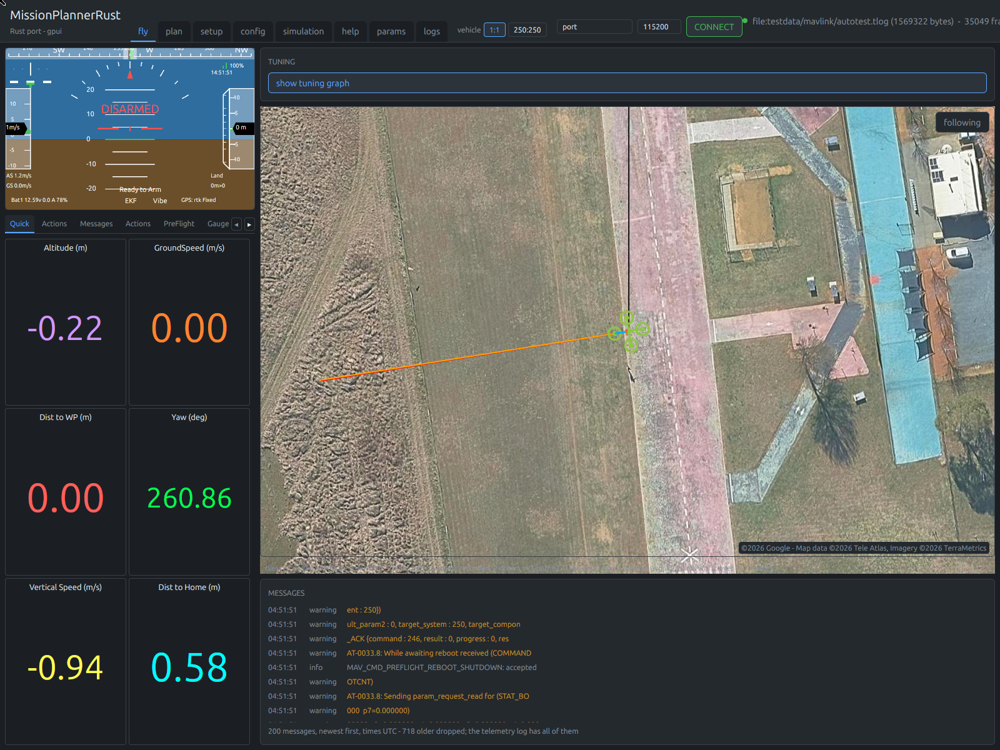
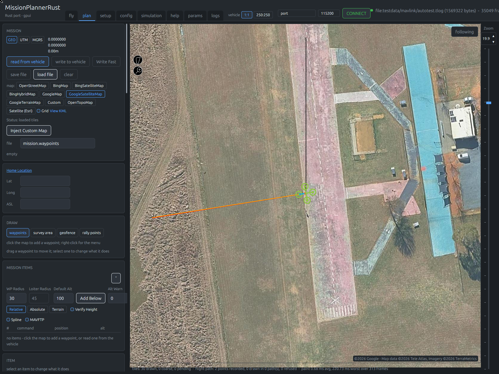

# Mission Planner, in Rust





*Both taken on 2026-10-03 from the current build, replaying a recorded flight (`testdata/mavlink/autotest.tlog`).*

A complete, file-by-file reimplementation of [ArduPilot Mission
Planner](https://github.com/ArduPilot/MissionPlanner) — 3,678 C# files, 1,208,836 lines, ~93
projects — as a Rust application that is **fast**, **multi-platform** and **GPU-accelerated**.

- **What we are building**: [DELIVERABLES.md](DELIVERABLES.md) — 21 deliverables, each with a
  falsifiable definition of done, the C# paths it replaces, and a numeric target.
- **Progress screenshots**: [docs/progress/](docs/progress/)

## Status

Early, but flyable behind SITL and a real autopilot. The protocol and telemetry spine is solid; the
UI covers flying, planning, the log browser, most of the setup and configuration pages, and the SITL
launcher.

Measured on this tree (2026-10-03): **28 crates, 422,325 hand-written Rust LOC** (plus 99,215
generated; `.rs` files under `crates/`, tests included), **4,033 tests** on `cargo test --workspace`
(47 ignored: they need SITL, a window, or the network), **202 GUI scripts** under `tests/gui/`,
across 355 commits. Linux first, and Windows since 2026-09-26 in the owner's Windows 10 VM - built
there, run against SITL, the whole GUI suite run there on 2026-09-27, the bench board flashed from
it (`win10_vm_setup.md`); macOS since 2026-10-03 on a borrowed Apple Silicon machine - built, the
whole test suite run there and a release binary made (`DEV_MACOS.md`). The repository has been public at
https://github.com/davidbuzz/MissionPlannerRust since 2026-10-03, where the three-OS workflow runs.

| Working today | |
|---|---|
| MAVLink v1/v2 codec | zero-copy parse, allocation-free encode (unproven: it writes into the caller's buffer, and no test counts its allocations), v2 signing |
| Generated dialect | 349 messages, 206 enums, generated from the upstream XML |
| Transports | serial, TCP, UDP, a UDP client, websocket and NTRIP (the last three held to the C# classes run under mono), file replay, in-memory test doubles; port enumeration by `CommsSerialPort.GetPortNames`'s rules, held to per-OS fixtures; faults and a real pty unplug rehearsed in tests |
| Link engine | I/O thread, multi-vehicle routing (50 systems in one test), stream requests; parameter sets, reads, commands and `COMMAND_INT`s, set-current, single mission items, the home-position ask and mission transfer with Mission Planner's own retry counts and waits, proved by counting sends under dropped, delayed and duplicated frames; every set and command the screens and `headless-planner` send goes through them |
| Vehicle state | lock-free snapshot bus, packet-loss tracking; all 550 of `CurrentState`'s members accounted for (471 held with the C#'s rules, 48 derived, 30 plumbing, 1 dropped), the last 55 matched per packet to the C#'s own `UpdateCurrentSettings` under mono |
| Parameters | fetched as Mission Planner fetches them: `@PARAM/param.pck?withdefaults=1` over MAVFTP first, the `PARAM_REQUEST_LIST` stream with gap recovery when that will not do; started on its own once a vehicle is heard and nothing is held; typed values, 1,408 from SITL |
| `.param` files | save, load and compare against a vehicle, honouring the C# skip-list |
| Parameter docs | fetched for the connected firmware as Mission Planner fetches them (`apm.pdef.xml`, versioned or weekly), read before the bundled table: 1,407 of a SITL's 1,408 documented instead of 798 |
| Missions | upload and download, `.waypoints` files, 129-file corpus |
| Survey grids | `Grid.CreateGrid`, `CreateCorridor` and `CreateRotary` transliterated over a port of ProjNet's UTM and the C#'s Clipper, bit-identical to the C# on 284 golden cases the real code generated under mono; the Survey (Grid) dialog is `GridUI.cs` whole, its Accept held to GridUI's own code under mono over 40 cases (5,656 Accept calls) bit for bit |
| Logs | `.tlog` read and write; ArduPilot `.BIN` dataflash parsing; the log browser with `LogBrowse.cs`'s two axes, data grid, map, double-click cursor, mode/error/message overlays, Show Params, the preselected graph sets, the five routes, point values, zoom and pan, the grid's export menu the field descriptions from `LogMessages.xml.xz`, every bitmask field's bits as child chips that graph the bit, and RCOU/RCIN's servo functions and channel mappings as the fields' tooltips - none of its 37 designer wirings missing (`docs/coverage/logbrowse.md`) - opening a 1 GB log to its first plot in about 0.6 s; `.BIN → .log`, KML+GPX and `.mat` conversions byte-identical to `BinaryLog`, `LogOutput` and `MatLab` run under mono; `FFT2` on `rustfft`, with the FFT window (`Controls/fftui.cs`) from SETUP's FFT Setup page and the Advanced page; ArduPilot's LogAnalyzer checks ported from the Python 2 source Mission Planner ships and run in-process (`crates/mp-log/src/analysis`, held to Python 2.7); the Spectrogram window |
| Flight recording | every connection recorded to a `.tlog`, both directions, into the `logs` directory of this application's own data directory |
| Data directory | a directory of its own, `~/.local/share/MissionPlannerRust` on Linux (`$XDG_DATA_HOME/MissionPlannerRust`, never `~/MissionPlannerRust`) and `Documents\MissionPlannerRust` on Windows, so neither application writes over the other's files; the C#'s is found by `Settings.cs`'s rules, mono quirks included; the first start with that directory missing or empty imports the C#'s `config.xml`, `poi.txt`, `cameras.xml` and its other user files once, leaving them as they were; `config.xml` is read for the last link, map type, log directory, planner home and quick views, and written whole on the C#'s events (start-up, the screen buttons, Connect, the close box), byte for byte what the C# writes for the same keys |
| Health | EKF variances and vibration with ArduPilot's own thresholds, clipping counts |
| Calibration | accelerometer, compass, radio and motor test as Mission Planner's own pages, `ConfigHWCompass2`, `ConfigRadioInput` and `ConfigMotorTest` ported whole, in its SETUP list, with Compass/Motor Calib; `MagCalib.cs`'s offboard sphere and ellipsoid fit over a log (`headless-planner magcal`), held to class D rather than 1e-6 because alglib's path cannot be bit-matched |
| Joystick | axes to `RC_CHANNELS_OVERRIDE` from a thread that blocks on the device and sends on change — 0.152 ms p99 stick-to-link on a fake device — with a release-on-disconnect failsafe, and the Joystick Setup page whole (Linux; the Windows device reader is owed, so Windows lists no joystick) |
| Firmware | `.apj` parsing, the px4 bootloader protocol, `BoardDetect.cs`'s board detection and `APFirmware.cs`'s catalogue with the Install Firmware page, proven against a mock, a pty and a manifest excerpt; `UploadPX4`'s reboot into the bootloader, port scan and upload wired to real ports and proven against the mock on a bench of pretend ports, and against the bench CubeOrange: ArduCopter 4.7.1 stable flashed from the Install Firmware page on 2026-09-25 from Linux and on 2026-09-27 from the Windows VM, "Upload Done" (PLAN §13.6 row 79); Install Firmware Legacy's flows reach a px4-family board the same way. Port failures during a flash go on the status line, never in a box (the owner's ruling). The reboot into the bootloader sends the C#'s four frames (3, 3, 1, 1) after two heartbeat waits, and a plain reboot on a serial port looks at the port half a second on and reopens it, "Connect Failed" on the status line when it will not (row 87) |
| Plugins | `crates/mp-plugin-host`: the C#'s `Plugin` lifecycle and `PluginHost` surface as a WIT world on wasmtime's component model; `*.wasm` in `plugins/` beside the executable loaded at start, each on its thread at its `loopratehz`, fuel-limited (a panic or a spin is a status line and an unload); the four shipped plugins and seven examples ported as `mp-plugins` and driven through the host in tests; packet subscription, sockets and the main window's members are not reachable, listed at the site (PLAN.md §13.6 rows 95-96) |
| Scripting | the Scripts tab on RustPython (Python 3): `Script.cs`'s `Script` and `cs` objects, Select, Run, Abort and Edit with the console under them; the 19 shipped scripts moved to Python 3 (`testdata/scripts/CHANGES.md`) and run under the engine in tests with a verdict each; scripts are handed `MAV`, `MainV2`, the screens, `Ports` and `Joystick` through a shim since 2026-09-26, so ten of the fourteen `import clr` scripts reach their end or loop as under IronPython and the other four stop on the C#'s own signatures |
| KML export | a flown path coloured by flight mode, and a mission, for Google Earth |
| Tuning graph | eleven telemetry fields plotted live, min/max reduced so a spike cannot hide |
| Geodesy | typed units, Web Mercator, slippy-map tile arithmetic; pixel, inverse, distance, bearing, `newpos` and UTM match the C# under mono bit for bit over 676 points |
| HUD | all 24 elements `HUD.cs` paints, from a pure scene builder with a coverage table, held to 18 golden frames drawn by a software rasteriser: horizon and ladder, heading tape with target and course marks, cross-track and turn rate, speed and altitude scrollers, VSI, mode and waypoint, link, battery, GPS, ARMED/DISARMED/SAFE/FAILSAFE, the message line, Vibe and EKF with the C#'s thresholds, Ready/Not Ready to Arm, custom items, flight-path vector and AOA scale; a camera's frame under it, started from the Planner page's Video Device (V4L2 on Linux, Media Foundation on Windows), the HUD menu's GStreamer, HereLink and MJPEG streams, and Record HUD to AVI |
| Maps | GPU tile rendering; Mission Planner's default `GoogleSatelliteMap` and six of its providers with its URL schemes and version checks, proved against its own `GMap.NET.Core.dll`; overlays; the on-disk cache is Mission Planner's own, so a cache filled by either application is read by both, and it is served by a thread that never waits on the network, with GMap.NET's five fetch threads behind it, so a cached view is on screen at start-up whatever the network is doing |
| CLI | `headless-planner watch \| record \| fly \| params \| param set\|save\|load\|diff \| mission \| survey \| log [bintolog\|dflogtokml\|matlab\|loganalysis\|fft] \| logs \| ftp \| fields \| kml \| firmware info\|detect\|list \| terrain \| georef \| magcal \| command \| ports` (`command` is bench scaffolding: one `COMMAND_LONG` and its ack) |
| GUI | fly, plan, setup, config, simulation (`SITL.cs`), params and log screens on gpui; the flight screen's lower-left is Mission Planner's fourteen-page tab control and SETUP/CONFIG are its backstage lists, every entry in the C#'s order under the C#'s conditions; `MainV2`'s port box, baud box and CONNECT/DISCONNECT at the top right, with each network kind's questions and the still-moving check (AUTO's port scan not ported) |
| DroneCAN, Sik Radio, warnings | the DroneCAN/UAVCAN page over `crates/mp-dronecan` (node 127, the transfer layer, SLCAN, MAVLinkCAN, multicast, the parameter window, firmware updates, passthroughs, the Inspector) and the Sik Radio page over `crates/mp-sikradio` (the AT/RT session, settings, SiK and RFD900x bootloader uploads), each against a scripted stand-in; the warnings engine (`Warnings/`) with its manager, `warnings.xml` as the C# writes it, the HUD's message and the quick views' colouring; the Onboard OSD page over `ExtLibs/OSDConfigurator` |
| Updates, crash reports, a package | `Utilities/Update.cs` and `Updater/Program.cs` as `crates/mp-update` behind the HELP screen; `Program.cs`'s `handleException` as a panic hook, the report under `crash-reports/` and the next start's question; `tools/package.sh deb` builds the Debian package, installed and removed in a clean container by a test; the cold start measured at 200 ms to the third frame |
| HTTP server | `Utilities/httpserver.cs` on 56781: the websockets, the KMLs for Google Earth, the HUD's JPEG stream, `/guided`, `/mavlink/`'s JSON, the files beside the program; the planner's View KML and the Geo Reference form's Location Kml open over it |
| Porting ledger | `ledger/ledger.csv`, one row per C# file with its tier and state - 196 past `ready` (187 `tested`, 9 `ported`) with their evidence and omissions, 117,472 C# lines, and 864 files `dropped` with their reasons, 149,229 lines: 461 with no callers (`xtask/tests/dead_csharp.rs` re-derives them), 354 at the owner's rulings, 44 separate programs, 4 empty files; `cargo xtask ledger check` fails on anything unaccounted for |
| Flight screen coverage | every one of `FlightData`'s 136 wired actions listed with what stands in for it here — 113 done, 1 elsewhere, 2 missing (Set Aspect Ratio, the owner's call; the HUD's pop-out), 18 plumbing, 2 dropped — in `docs/coverage/flightdata.md`, kept current by a test; the lower-left is Mission Planner's own fourteen-page tab control with its Quick view, its tlog playback, its DataFlash Logs page and log downloader, and its Actions page (Set WP, Restart/Resume Mission, Change Alt/Speed/Loiter Radius, Fly To Coords, Abort Landing, Do Action, Jump To Tag) sends what the C# sends, with a script each against SITL (`fly-resumemis.gui` asserts the C#'s own outcome on ArduCopter, which refuses a take-off once airborne, PLAN.md §13.6 row 67); the DataFlash page's conversions run on a thread against the golden files; the HUD's right-click menu has Russian HUD, Ground Color, User Items, Swap With Map, Show icons and Battery Cell Voltage; Set Home/EKF Origin, the camera and gimbal commands, the Transponder page and the speed dial are there too; since 2026-10-03 the RAW Sensor window, Camera Overlap's photo markers, Record HUD to AVI and the Geo Reference form's Location Kml |
| Configuration coverage | every one of the 61 `Config*.cs` panels listed in Mission Planner's SETUP and CONFIG order with what stands in for it here — 41 done, 6 partial, 0 missing, 2 plumbing, 12 dropped at the owner's ruling — in `docs/coverage/configuration.md`, held to the C# by tests; every page has its `config-*.gui` script, run in the Linux suite of 2026-09-26 and the Windows suite of 2026-09-27 or headless at its commit; the six partial pages are named in the report with what each still owes |
| Planner coverage and menu | every one of `FlightPlanner`'s 121 wired actions listed the same way — 107 done, 2 missing (Rotate Map, blocked on the renderer; GDAL Opacity, the owner's call), 12 plumbing — in `docs/coverage/flightplanner.md`; the map's right-click menu is Mission Planner's, in its order, every entry but those two working, 8 more on the polygon icon's menu, each held to its ledger row by `planner_coverage.rs`'s tests; home is its Home Location boxes written first and drawn as its green pin, the panel's radius and altitude boxes set the C#'s parameters after Write; 60 `plan-*.gui` scripts drive them |

**GUI scripts run at the application's pace.** `tests/gui/` holds 202 scripts. The owner runs them
(`tools/gui-test.sh`, or `tools/gui-suite.sh` for several); they take the machine's pointer, so no
agent does. No script waits a fixed time: `expect` polls its fact for up to ten seconds, a click
waits for its control, and every script carries `budget N`, the run time it is expected to take
(PLAN.md §13.6 row 97) - a run over it fails, and one three seconds past it is killed after a
screenshot of the window. Results of the last full Linux pass (2026-09-26, with its re-runs): of the 172 scripts then, 169 passed at their latest run on this machine against SITL; `storm` is skipped by a
debug-build suite (its number is the release build's: run in release on 2026-09-26 with nothing
else building it passes whole - frames p99 3.8 ms with no stall in 570 at 200 Hz, packet-to-pixel p99
14.7 ms) and `config-compass-livecal` without an
ArduPlane 3.7.1-4.0 SITL; the two `-bench` scripts flash the CubeOrange and run only on the owner's
word (both ran on 2026-09-25). The full suite runs in about 25 minutes where the settled scripts took over 50. The whole suite also ran in the owner's Windows 10 VM on 2026-09-27 at 16895c7: 148 pass, 22 pass over budget, 4 fail (three budgets since retimed, one lost wheel notch since spaced), 3 skip by design, of 177. The 25 scripts written since (2026-10-02 and 2026-10-03) each passed headless at their commit; no full pass has been run since. `tools/gui-headless.sh` runs the same scripts on a virtual X display (Xvfb, the
application drawn by Mesa's lavapipe), so a run needs neither the desktop nor its pointer: found
on 2026-09-26 when the desktop's session-failed screen took every click, and used since for the
Quick page's scripts. `sitl-launch.gui` (the SIMULATION tab's copter picture starting a simulator and the
application flying it) needs port 5760 free and is skipped by a suite whose SITL holds it.

**Not yet**: the planner's window opened on a macOS desktop (built, tested and released there over SSH,
`DEV_MACOS.md`, CI's macOS job runs the smoke step); on Windows the planner has been built, run against SITL, put through the whole GUI suite and used to flash the bench board in the owner's Windows 10 VM (2026-09-26 and 27, `win10_vm_setup.md`), but no release is built there, the unit tests have not been run there, and the repository has no remote, so the three-OS CI matrix has never executed - the columns in `DELIVERABLES.md` say so; a joystick latency histogram from a real device
(none is attached to this machine); i18n beyond the flight screen (its 46 tab and button texts read the
`.ftl` files generated from the `.resx`, in the culture that config.xml's `language` names; every other screen's
words are still in the code, held at the owner's word); packaging beyond the Debian package - signing, the AppImage, the MSI and the `.dmg` are not started; speech (`Utilities/Speech.cs`). `PLAN.md` §13.6 is the queue, re-prioritised on 2026-09-24, and says what
*done* means for each.

## Verification

The port is checked against the original rather than against our reading of it. **The C# source is
the specification** - https://github.com/ArduPilot/MissionPlanner at commit efb0801, a clone of which the
environment variable `MP_SRC` names; it is not part of this repository - and a behaviour is ported by
reading the `.cs` file, not by recalling what it probably does. The C# implementation's own output,
recorded by running its code headless under mono, is the reference:

- **35,750 frames** of a real ArduPilot flight decode identically to Mission Planner's own
  `MAVLink.dll` — msgid, sequence, ids, payload length, CRC and raw bytes.
- **24,626 field values** across 3,000 messages match field-by-field *by name*, via reflection
  over the C# structs. A field at the right offset with the wrong name round-trips perfectly and
  is still wrong everywhere it is displayed.
- **349 of 349** generated `CRC_EXTRA`, `min_len` and `len` values match the table inside the
  shipped assembly.
- On a second corpus we decode **85 frames the C# parser drops**, with none missed — its reader
  loses sync after a corrupt frame. Every extra frame passes CRC with the correct per-message
  seed.
- **0 heap allocations per packet** from bytes to a published vehicle state, proved by a
  counting allocator: 211,638 frame decodes and 70,546 frames through the real link thread,
  recording on (`crates/*/tests/no_alloc*.rs`). The three message types that allocate by design
  — a parameter arriving, the vehicle speaking, a command acknowledged — are named in the test
  with a bound each, and the test fails if a fourth appears.
- A map tile the real Mission Planner wrote on this machine — in its own
  `gmapcache/TileDBv3/en/<provider>/<z>/<y>/<x>.jpg` layout — reads back byte for byte and
  decodes (`crates/mp-tiles/tests/tilecache.rs`; the test says so and skips where no such cache
  exists).

Run it yourself: `cargo test` compares against the recorded corpora under `testdata/`.

Beyond the differential corpus: a smoke test that opens a window and paints,

written into the CI workflow for Linux, Windows and macOS and run on Linux here — the only thing
that exercises a graphics backend rather than merely compiling it. The workflow runs on GitHub -
the repository is public at https://github.com/davidbuzz/MissionPlannerRust since 2026-10-03 - and
its first runs are being worked through.

The UI is driven and **checked**, not photographed. `tools/gui-test.sh` runs a script of clicks
and keystrokes against the real binary and asserts on what the application says it believes:

```sh
tools/gui-test.sh tests/gui/waypoint-click.gui -- tcp:127.0.0.1:5760
```
```
  ok   mission.items = 0
clicking 'map@0.45x0.40' (button 1) at window-relative 945,511
  ok   mission.items = 3
```

The facts come from the application itself (`MP_FACTS`, see `crates/mp-gui/src/facts.rs`), so a
feature that quietly stops working fails the run rather than producing a screenshot somebody has
to look at. An expectation naming a fact that no longer exists is an error, not a pass.

## Build and run

```sh
cargo build --workspace
cargo test --workspace

headless-planner watch tcp:127.0.0.1:5760     # ArduPilot SITL
headless-planner watch udp:14550              # bind and wait for a vehicle
headless-planner watch file:flight.tlog       # replay a recording
headless-planner record udp:14550 flight.tlog
headless-planner param save tcp:127.0.0.1:5760 backup.param
headless-planner param diff backup.param proposed.param
headless-planner kml flight.tlog flight.kml
planner                          # the graphical front end
```

A Linux build needs libclang and the kernel's UAPI headers (`linux-libc-dev`): `mp-video`'s V4L2
bindings run bindgen at build time (`crates/mp-video/Cargo.toml`).

The GUI records every flight without being asked, into its own data directory's `logs` —
`~/.local/share/MissionPlannerRust/logs` on Linux (`$XDG_DATA_HOME` when set, and never
`~/MissionPlannerRust`), `Documents\MissionPlannerRust\logs` on Windows - a directory of its own
rather than the C#'s `Mission Planner`, so a user running both loses nothing to the other (see
`crates/mp-settings`). On the first start that finds that directory
missing or empty, Mission Planner's `config.xml`, `poi.txt`, `cameras.xml`, `checklist.xml`,
`warnings.xml`, `UserAlerts.json`, `authkeys.xml`, `logo.png`, `logo.txt` and `History` are
copied into it once and left untouched where they were; the tile cache, terrain, logs and
parameter metadata are not copied, and are fetched or recorded again. Map tiles go to the same
place's `gmapcache`. `MP_NO_RECORD` turns recording off.

Requires a recent stable Rust (see `rust-toolchain.toml`). `DEV_MACOS.md` is the same process on a
Mac, with what it measured, through to the release binary.

## Layout

```
crates/
  mp-mavlink           wire format: framing, checksums, signing
  mp-mavlink-dialects  generated message types (do not edit)
  mp-transport         serial, TCP, UDP, UDP client, websocket, NTRIP, replay, test doubles
  mp-vehicle           decoded state, the snapshot bus, EKF and vibration health
  mp-link              the live link: I/O thread, routing, commands, mission transfer, recording
  mp-params            parameter values and metadata, the downloaded table, .param files
  mp-calibration       accelerometer, compass, radio and motor-test calibration, MagCalib.cs's offboard fit
  mp-ftp               files off the vehicle: dataflash log download and MAVFTP, from MAVFtp.cs
  mp-mission           missions, fences, rally points, survey grids
  mp-log               .tlog reading, dataflash parsing, the log conversions, FFT2
  mp-tiles             map tile fetching, decoding and caching
  mp-input             joystick and gamepad, mapped to RC channels
    mp-firmware          .apj files, the px4 bootloader protocol, board detection, the firmware catalogue
  mp-dronecan          DroneCAN: node 127, the transfer layer, SLCAN, MAVLinkCAN, multicast, parameters, firmware update
  mp-sikradio          SiK radio: the AT/RT session, settings, the SiK and RFD900x bootloaders, IHex, XModem
  mp-update            Update.cs and Updater/Program.cs: the version check, the download, the swap and restart
  mp-plugin-host       WebAssembly plugins on wasmtime's component model: the C#'s Plugin lifecycle as a WIT world
  mp-script            the scripting host API and corpus analysis
  mp-kml               missions and flight paths as KML
  mp-chart             time series for the tuning graph and log plots
  mp-units             typed units and geodesy
  mp-settings          where Mission Planner keeps things on disk, ported from Settings.cs
  mp-terrain           srtm.cs: SRTM tiles, the download queue, getAltitude, proved against the C# DLL
  mp-georef            georefimage.cs: photos matched to a log by time, CAM or TRIG, every output byte for byte to the C#
  mp-video             V4L2 capture, GStreamer pipelines and MJPEG streams for the HUD's camera frame
  mp-cli               `headless-planner`
  mp-gui               `planner`, built on gpui
xtask/                 codegen and repository invariants
assets/i18n/           the .ftl per culture, generated from Mission Planner's .resx, with the key map and the zero-loss report
tests/gui/              click-and-assert UI tests, run by tools/gui-test.sh
testdata/              golden corpora

```

## Licence

GNU General Public License version 3 only (`LICENSE`; SPDX `GPL-3.0-only`), Copyright (C) 2026
David "Buzz" Bussenschutt. MissionPlannerRust is legally derived-from or translated-from Mission
Planner (Copyright (C) 2010-2024 Michael Oborne and contributors, GPL version 3, whose
`COPYING.txt` grants no later version), and `NOTICE` says what was changed. Every Rust file opens with the
licence header (`xtask/src/licence.rs` holds it; `xtask/tests/licences.rs` fails on a file
without it). `THIRD_PARTY_LICENSES` records the code and data that reached this work through
Mission Planner's tree (Clipper, ProjNet, GeoUtility, the EGM96 geoid, the PX4 uploader,
libcanard, MAVLink, ArduPilot's metadata and LogAnalyzer, GMap.NET, ...) with their notices, and
every crate the binaries are built from with its licence - a table `cargo xtask licences` writes
from `cargo metadata` and the test keeps current. Inbound dependencies are restricted to
GPLv3-compatible licences by `deny.toml`, checked by that test and by `cargo-deny`.
